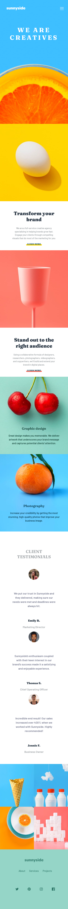

# Frontend Mentor - Sunnyside agency landing page solution

This is a solution to the [Sunnyside agency landing page challenge on Frontend Mentor](https://www.frontendmentor.io/challenges/sunnyside-agency-landing-page-7yVs3B6ef). Frontend Mentor challenges help you improve your coding skills by building realistic projects.

## Table of contents

- [Overview](#overview)
  - [The challenge](#the-challenge)
  - [Screenshot](#screenshot)
  - [Links](#links)
- [My process](#my-process)
  - [Built with](#built-with)
  - [What I learned](#what-i-learned)
  - [Continued development](#continued-development)
- [Author](#author)

## Overview

### The challenge

Users should be able to:

- View the optimal layout for the site depending on their device's screen size
- See hover states for all interactive elements on the page

### Screenshots
##### Mobile Design

#### Desktop Design

### Links

- Live Site URL: [Add live site URL here](https://bit.ly/3vpohE7)

## My process

### Built with

- Semantic HTML5 markup
- CSS custom properties
- Flexbox
- CSS Grid
- Desktop-first workflow

### What I learned

I used this project to practice laying out elements on the page using Flexbox & Grid Css . I also wrote my first two lines in javascript to make the humburger menu . The page had multiple sections which was a good opportunity to refresh on semantic html tags . I also learnt a lot about responsive design and media queries .

### Continued development

I'd like to practice using Grid a little bit more just to get the hang of it , especially properties that have to deal with the responsivness of the layout to avoid using media queries , i'm planning on starting a course on javascript next , so probably i'll be implementing a lot of what i'm learning on my next project to make it even more interactive .

## Author

- Instagram - [@nass_drawss](https://www.instagram.com/nass_drawss)
